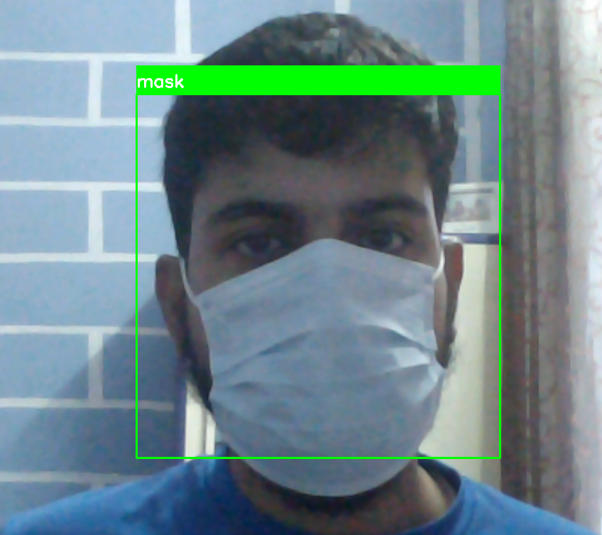
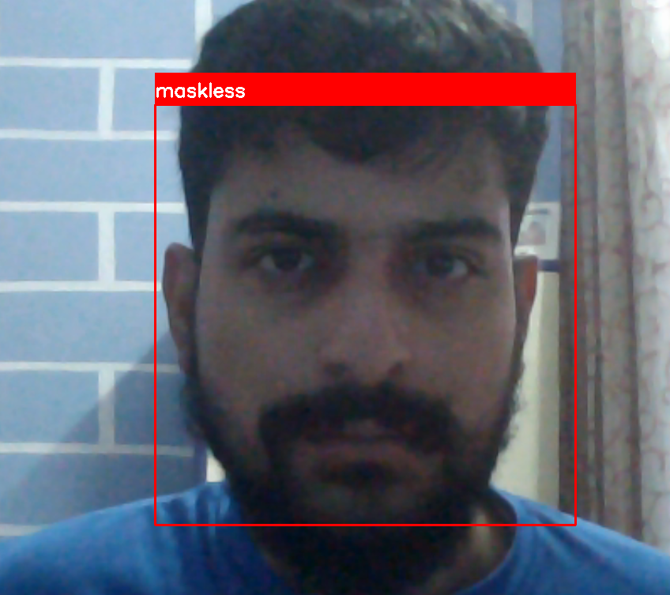

## Real time face mask detection 
### (Task 4 from Computer Vison and IOT, completed in association to internship at The Sparks Foundation)
### visit: https://www.thesparksfoundationsingapore.org/

## Install and run

In the root of the directory execute following commmands:

```bash
$ python3 -m venv venv
$ source venv/bin/activate
(venv)$ pip3 install -r requirements.txt
```
At first we are creating a virtual environment to install all requied packages to run the detector.
Then, visit the option available to either run the detector in image or real time video mode.

```bash
(venv)$ python3 detect.py -h
```

In order to run in real time:
```bash
$ python3 detect.py --camera 0
```
Here, 0 is the camera device number in my device, it can by any number for you, please look into your system to identify the camera device number and supply it accordingly.


In image only mode:
#### with mask


#### maskless



In video only mode:


